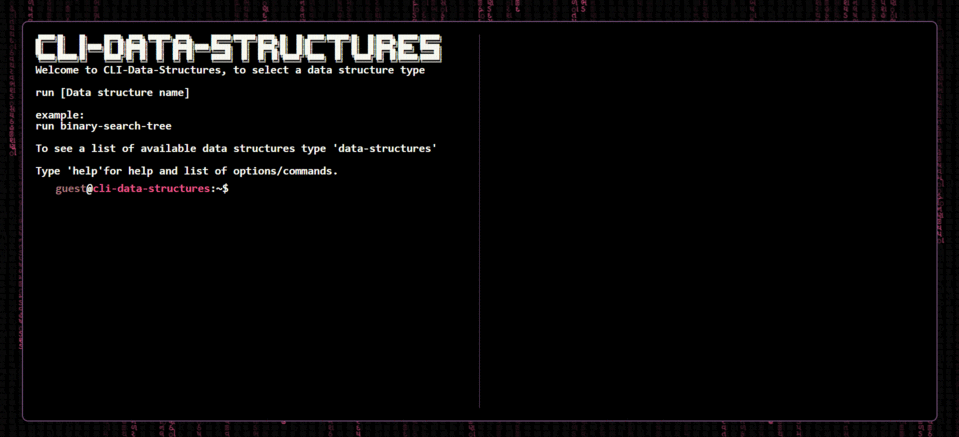

# CLI-Data-Structures
CLI styled application, type help to start and see the list of available options. 
This app visually presents different data structures, information about them as well as implementation code for each data structure. 
It also has many secondary commands such as changing theme, try theme random. 
To use autosuggest option use TAB. Use keyboard up / down to load previous / next command. 
This app is primarily intended to be used on PC.

[Live Demo](https://nikolamilinkovic.github.io/CLI-data-structures/) ✨

## Features
- CLI styled application
- Visual presentation of data structures and controls for its manipulation
- Many available CLI Themes
- Autocomplete [TAB]
- Input history [arrow up / down]

**🧭 Possible Future Implementations**
- New data structures
- Add algorithms and visual representation of their working. 

## 💻 Built With

